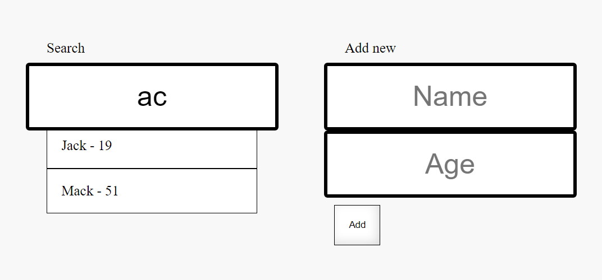
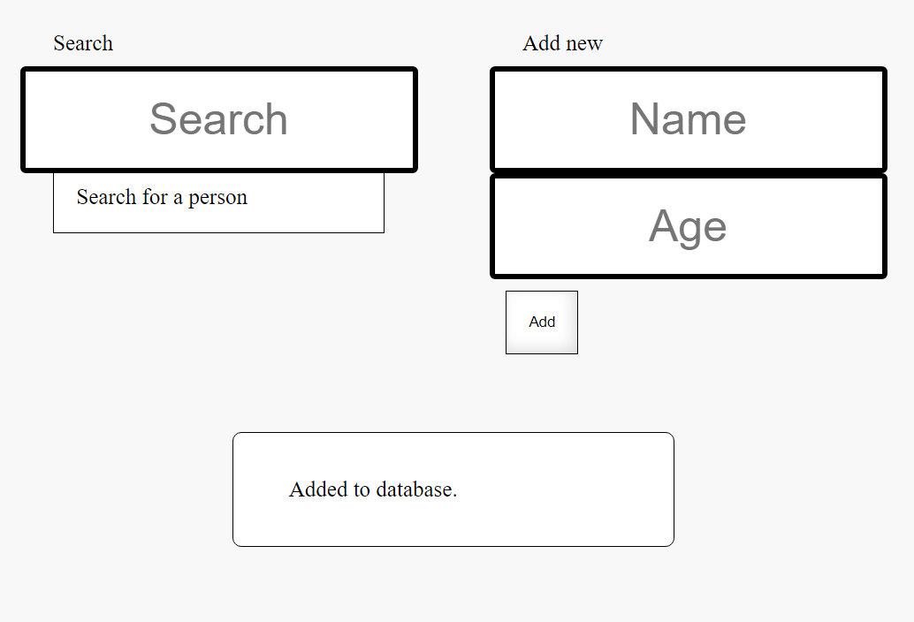
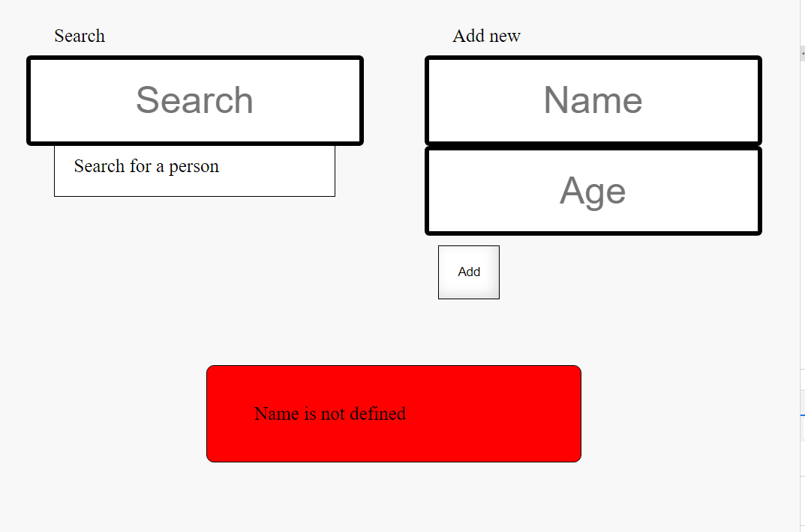
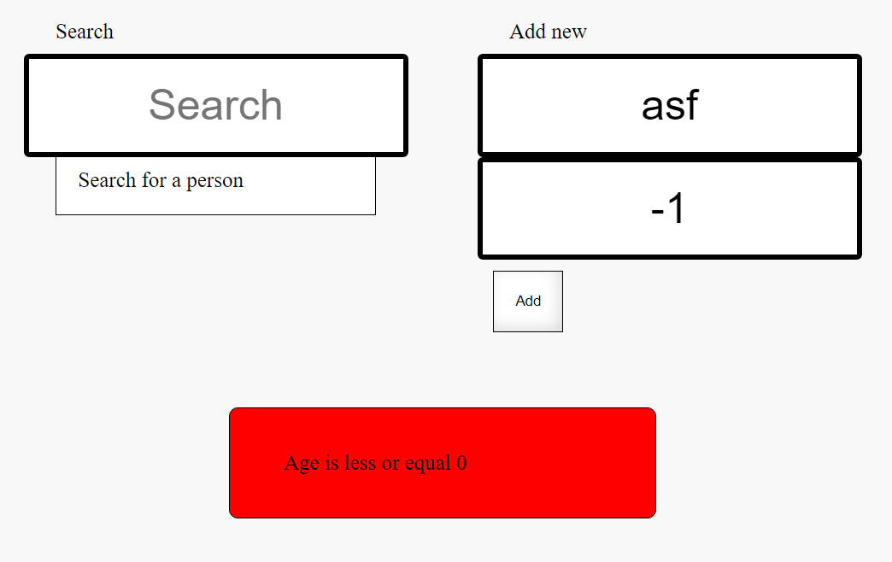

## Requirements

  Client needs simple user management page with 2 main sections:
  - search - type name (ignore case sensitivity) to get assigned value
  - add new - type name and age, validate and add to database

## Tech stack
  FE:
  - vanilla js

  BE:
  - node.js
  - express.js
  - jest and supertest for testing

## Running app

To run the app:
1. In ``` src/ ```
    folder run in terminal
    ```bash
    $ npm install

    $ node app.js
    ```
    Optionally, create ``` .env ``` file in ``` src/ ``` folder and add
    ```
    PORT=8000
    ```
    in it.

    Open ``` localhost:8000/ ``` in the browser.

2. To run backend tests type in ``` src/ ``` folder in terminal
    ```bash
    npm run test
    ```

## Screenshots








